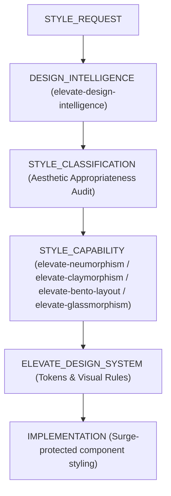

# Elevate Design Intelligence Skill (V4.3)

## Purpose
Establishes ElevateLivingCo as an authoritative luxury interior-design publication by grounding visual layouts, room advice, decor recommendations, and UI/UX design decisions in spatial proportions, visual weight, material harmony, lighting physics, cohesive art direction, reference-evidence analysis, interaction quality, CSS specificity inspection, rendered contrast measurement, and an internal Awwwards-quality design standard.

---

## 1. The Cohesive Art Direction Layer (MANDATORY FOR MAJOR PAGES)

Before implementing any major new page or major redesign, Antigravity MUST define a compact **Creative Direction Brief**:

1. **Visual Thesis:** Core storytelling angle and emotional ambiance.
2. **Hero Focal Asset:** The primary visual anchor establishing identity and subject.
3. **Typography Hierarchy:** Display face, editorial face, and UI/microcopy face pairing.
4. **Color / Material System:** Primary palette, accent tones, texture/material palette.
5. **Section Sequence:** Storytelling progression from hero to final call to action.
6. **Motion Narrative:** Purposeful motion progression reinforcing section flow.
7. **Interaction Language:** Cohesive feedback patterns for hover, focus, touch, and state changes.
8. **Smooth-Scroll Decision:** Explicit evaluation of native scroll vs. Lenis/Locomotive.
9. **Three.js / WebGL Decision:** Explicit justification of spatial depth or object exploration requirements.
10. **Asset Provenance Plan:** Classification of all visual assets across sources A through F.
11. **Responsive Strategy:** Fluid composition scaling across 375px, 768px, 1024px, 1440px viewports.

> [!CAUTION]
> **REJECT DESIGNS WHERE:**
> - Typography is luxury but imagery is generic stock.
> - Animation exists without narrative purpose or editorial reason.
> - 3D/WebGL exists only because it is technically impressive.
> - Background media contradicts the editorial content.
> - Cards, buttons, and sections look like unrelated design systems.
> - Every section uses a different aesthetic or visual language.

---

## 2. Reference Evidence Rule (PRINCIPLES OVER REPRODUCTION)

When provided with visual references (screenshots, websites, reels, videos, design examples):
- **ALWAYS** inspect the reference completely before implementation when technically possible.
- **EXTRACT ONLY** high-level design principles: hierarchy, pacing, spatial contrast, image treatment, typography relationships, spatial composition, motion principles, and interaction patterns.

> [!CAUTION]
> **STRICT PROHIBITION:**
> - NEVER trace the reference element-by-element.
> - NEVER copy source code or stylesheet snippets.
> - NEVER reproduce reference screenshots or proprietary media.
> - NEVER reuse third-party brand identities, trademarks, or distinctive layouts too closely.
> - NEVER copy copywriting, prose, or slogan text.
> - NEVER imply affiliation with or endorsement by the reference source.
> 
> **FORMULA:** $\text{Reference} \rightarrow \text{Design Principles (Materially New Elevate Design)}$.  
> **NEVER:** $\text{Reference} \rightarrow \text{Reproduction}$.

---

## 3. Hero Quality Bar (THE FIRST VIEWPORT)

The first viewport MUST be the strongest, most cohesive authored moment of the page:
- Establish identity, subject, hierarchy, atmosphere, action, and visual language immediately.
- Ingredients may include original imagery, cinematic media, pointer-responsive composition, layered 2.5D, or justified Three.js—used with restraint.
- **Resilience Standard:** The hero MUST remain complete and understandable if JavaScript fails, WebGL fails, video fails, or external fonts fail. Navigation, primary message, and primary CTA must be usable before animations complete.

---

## 4. UI/UX Interaction Discipline (MERGED CAPABILITIES)

Extracted and adapted from high-end UI/UX guidelines:
- **Touch Target Minimum:** All interactive buttons, links, and cards MUST maintain a minimum target area of **44x44px** on touch viewports.
- **Stable Hover Transitions:** Hover states MUST use color/opacity/box-shadow transitions. NEVER use scale or transform rules on hover that cause adjacent layout thrashing or text shifting.
- **Cursor Pointer Rule:** Apply explicit `cursor: pointer` to all clickable cards, image links, and custom controls.
- **Z-Index Scale Discipline:** Manage stacking contexts using a strict scale (`z-index`: 1, 10, 20, 30, 50, 100). Never use arbitrary values like `z-index: 99999`.
- **Measure Discipline:** Limit long-form body text lines to **65–75 characters per line** for optimal reading comprehension.

---

## 5. Internal Awwwards-Quality Acceptance Bar

"Awwwards quality" is an internal design benchmark only. To pass this quality bar, a page must demonstrate:

1. Distinct, intentional art direction
2. Memorable first viewport
3. Strong, disciplined typography hierarchy
4. Intentional image treatment & aspect ratio consistency
5. Coherent, grid-aligned spatial spacing
6. Meaningful section transitions
7. Refined hover and focus-visible states
8. Refined touch targets and mobile interactions
9. Clear loading states
10. Robust error & fallback states
11. Full reduced-motion alternative presentation
12. Fluid responsive composition across all viewports
13. Clean semantic HTML structure
14. Strict performance & payload discipline
15. Absolute conversion & editorial clarity

> [!WARNING]
> **COMMUNICATION RULE:** Never claim that ElevateLivingCo is "Awwwards-recognized", "award-winning", "featured on Awwwards", or "endorsed" unless independently verified official evidence is provided.

---

## 6. Rejection of Generic Design Patterns

REJECT the following generic design clichés unless explicitly justified:
- Generic background gradient blobs
- Ornamental bento grids lacking editorial hierarchy
- Omnipresent glassmorphism / heavy backdrop blur on every card
- Generic SaaS card containers and dashboard widgets on interior design pages
- Fake customer testimonials or invented partner logos (logo-wall theater)
- Meaningless 3D geometry floating in space
- Decorative SVG skeletons used to simulate artwork
- Scroll animations applied indiscriminately to every DOM node
- Excessive rounded corners breaking architectural grid discipline
- Random parallax rates that break visual alignment
- Interaction patterns that obscure essential editorial copy

---

## 7. Mandatory 16 Validation Gates (PRE-RELEASE CHECKLIST)

Every major page or redesign implementation MUST pass all 16 gates:
1. **Gate A — Art Direction Documented:** 10-point brief defined.
2. **Gate B — Reference Evidence Inspected:** High-level principles extracted without reproduction.
3. **Gate C — Asset Provenance Documented:** All media assigned to provenance classes A–F.
4. **Gate D — Typography System Defined:** Display, body, UI faces paired consistently.
5. **Gate E — Motion System Defined:** GSAP-first motion ladder assigned.
6. **Gate F — Smooth-Scroll Decision Documented:** Lenis/Locomotive or native browser scroll explicitly selected.
7. **Gate G — Three.js Decision Documented:** Spatial/exploration justification documented.
8. **Gate H — Static Fallback Verified:** Fully functional without JS/WebGL.
9. **Gate I — Reduced-Motion State Verified:** Auto-rotation frozen, scrubbed timelines bypassed.
10. **Gate J — Accessibility & Contrast Checked:** Rendered WCAG AAA/AA contrast measured in browser across default, `:hover`, `:focus`, `:active`, and `:visited` states.
11. **Gate K — Affiliate & Source Integrity Checked:** Zero invented facts, ASINs verified, tag preserved.
12. **Gate L — Responsive UAT Performed:** Verified across 8 viewports (375px to 1440px).
13. **Gate M — Console & Network Checked:** 0 console errors, 0 failed network requests.
14. **Gate N — Performance Measured:** CWV thresholds met, payload within budget.
15. **Gate O — Regression Audit Passed:** 0 consumer regressions.
16. **Gate P — Production-File Protection Passed:** 0 unintended file modifications.

---

## 8. CSS Specificity & Visual Contrast Gates (MANDATORY V4.3)

> [!IMPORTANT]
> **1. CSS SPECIFICITY REGRESSION GATE:**
> For any visual defect involving color, typography, spacing, sizing, positioning, z-index, or interaction states:
> - **Reproduce in a real browser first** and inspect actual rendered computed styles (`window.getComputedStyle`).
> - **Identify the winning selector and its exact specificity source** (e.g., `[data-theme] a` with specificity `0,1,1` overriding single class `.btn` with specificity `0,1,0`).
> - **Never write CSS fixes without identifying the winning selector.**
> - Scope fixes to match or exceed the winning selector's specificity (e.g. `[data-theme] .btn`).

> [!IMPORTANT]
> **2. VISUAL CONTRAST GATE:**
> - Verify rendered text and background color across all 5 interaction states: default, `:hover`, `:focus`, `:active`, and `:visited`.
> - Measure actual computed contrast ratio in the browser (`getComputedStyle(el).color` vs `getComputedStyle(el).backgroundColor`).
> - **Never infer contrast solely from source CSS file inspection.**

---

## 9. Design Style Governance & Canonical Selection Pipeline (V4.5)

### Canonical Style Selection Flow
All visual style requests (Neumorphism, Claymorphism, Bento Layout, Glassmorphism) MUST execute through this canonical pipeline:

### Mandatory Governance Rules
1. **Rule 1 (Advisory Status Gate):** A design style capability (`elevate-neumorphism`, `elevate-claymorphism`, `elevate-bento-layout`, `elevate-glassmorphism`) is advisory/implementation knowledge only, NOT an independent production authority.
2. **Rule 2 (Visual Metaphor Isolation):** Do NOT mix visual metaphors arbitrarily on a single page (e.g., combining Neumorphic extruded cards with Claymorphic 3D bubbles and Glassmorphic translucent overlays simultaneously).
3. **Rule 3 (Secondary Style Role Gate):** A secondary visual style may be used ONLY when `elevate-design-intelligence` identifies a legitimate supporting role aligned with the Creative Direction Brief.
4. **Rule 4 (Brand System Precedence Gate):** Existing `elevate-design-system` constraints (brand tokens, WCAG AA contrast, responsive grids) remain strictly authoritative and CANNOT be overridden by external style skills.

---

## Related Skills
- `elevate-neumorphism`: Tactile extruded surface component specifications.
- `elevate-claymorphism`: Soft rounded 3D clay callout components.
- `elevate-bento-layout`: Asymmetric 12-column modular grid layouts.
- `elevate-glassmorphism`: Translucent frosted-glass surface treatments.
- `elevate-editorial-retention`: Structures article narrative flow.
- `elevate-visual-assets`: Asset provenance, media art direction, icon systems, licensing.
- `elevate-immersive-motion`: Controls motion ladders, GSAP choreography, and smooth-scroll engines.
- `elevate-3d-web-experience`: Technical WebGL and Three.js decision framework.
- `elevate-human-psychology`: Connects spatial choices to ethical cognitive principles.

