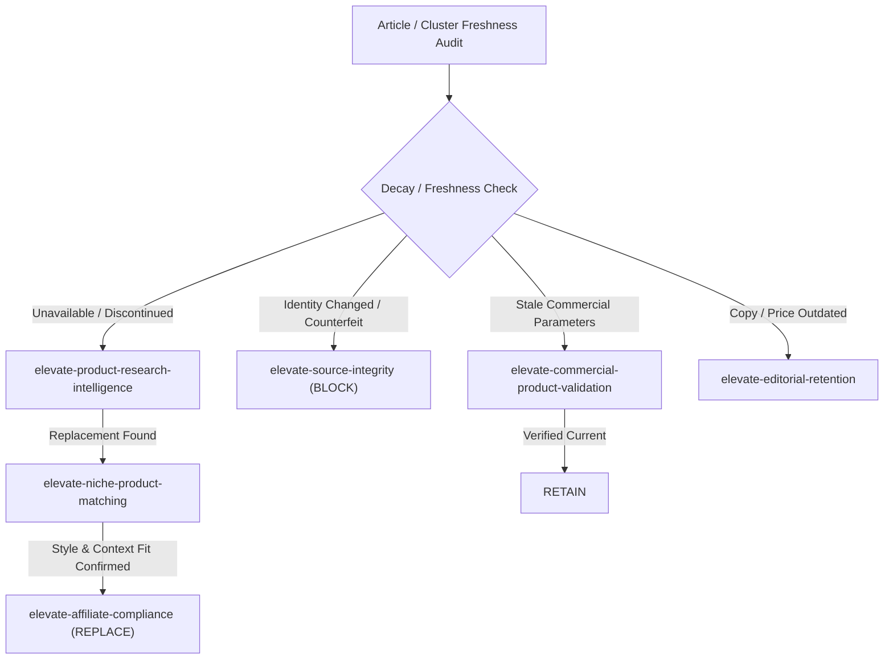

# Product Freshness & Replacement Intelligence (v1.0)

## 1. Overview & System Role

`elevate-product-freshness-intelligence` is Elevate's specialized longitudinal product freshness, decay tracking, and replacement decision-support skill. It determines whether existing product recommendations across published articles and content clusters remain valid, accurate, commercially usable, editorially appropriate, and visually aligned over time.

### Core Question Answered
> "Is this existing product recommendation still valid, useful, commercially usable, and editorially appropriate for its context, or does it require reverification, refresh, research, replacement, or removal?"

### Key Architectural Boundaries
- **Does NOT** perform single-point commercial verification (owned by `elevate-commercial-product-validation`).
- **Does NOT** evaluate initial aesthetic or room style fit (owned by `elevate-niche-product-matching`).
- **Does NOT** perform candidate quality research from scratch (owned by `elevate-product-research-intelligence`).
- **Does NOT** score cross-dimensional topic opportunities (owned by `elevate-product-opportunity-scoring`).
- **Does NOT** perform web scraping of retail sites (owned by `elevate-web-scraping-product-discovery`).

---

## 2. The 20 Freshness Evaluation Dimensions

Every longitudinal freshness audit evaluates a product recommendation against 20 explicit dimensions:

1. **Product Identity Consistency (`IDENTITY_STATUS`):** Physical item parity, model name, brand name, ASIN.
2. **ASIN Status (`ASIN_STATUS`):** Active, canonical redirect, merged ASIN, dead ASIN.
3. **Destination URL Validity (`DESTINATION_STATUS`):** Live 200, 301/302 redirect, 404, affiliate param intact.
4. **Marketplace Parity (`MARKETPLACE_STATUS`):** `AMAZON_US` vs `AMAZON_IN` alignment with target audience.
5. **Variant Consistency (`VARIANT_STATUS`):** Specific color, size, finish, or bundle verified.
6. **Stock & Availability Freshness (`AVAILABILITY_FRESHNESS`):** `IN_STOCK`, `LOW_STOCK`, `OUT_OF_STOCK`, `UNKNOWN`.
7. **Price Freshness & Stability (`PRICE_FRESHNESS`):** Price change delta, observation timestamp, price stability index.
8. **Promotion & Discount Freshness (`PROMOTION_FRESHNESS`):** Sale active, coupon active, expired promotional copy.
9. **Image Freshness & Parity (`IMAGE_FRESHNESS`):** Image URL accessible, image matches current physical item/variant.
10. **Product Specification Freshness (`SPEC_FRESHNESS`):** Dimensions, materials, features match current listing.
11. **Brand & Seller Authority (`SELLER_FRESHNESS`):** Brand ownership active, seller rating shifts, brand rebranding.
12. **Editorial Relevance & Context (`EDITORIAL_FRESHNESS`):** Recommendation fits current article copy, narrative, tone.
13. **Trend Relevance & Phase (`TREND_FRESHNESS`):** Style phase (`EMERGING`, `PEAK`, `MATURE`, `DECLINING`, `EVERGREEN`).
14. **Seasonal Relevance & Window (`SEASONAL_FRESHNESS`):** Active season alignment, off-season retention suitability.
15. **Problem / Solution Relevance (`PROBLEM_FRESHNESS`):** Product still solves problem described in article block.
16. **Niche & Style Fit (`NICHE_FRESHNESS`):** Aesthetic alignment with current article style standard.
17. **Portfolio Role Balance (`PORTFOLIO_FRESHNESS`):** Contribution to article/cluster diversity and anchor balance.
18. **Article Context Fit (`ARTICLE_CONTEXT_FRESHNESS`):** Text surrounding link matches current product reality.
19. **Product Quality Evidence (`EVIDENCE_FRESHNESS`):** Review volume updates, rating shifts, defect reports.
20. **Last Verification Date (`LAST_VERIFIED_AT`):** Timestamp of last explicit verification event.

---

## 3. Freshness Action States Matrix

The skill evaluates all 20 dimensions and outputs exactly ONE primary action state:

| Action State | Description | Next Handoff Skill |
|---|---|---|
| `RETAIN` | Product is fully verified, accurate, editorially sound, and commercially live. | None (Keep as-is) |
| `REVERIFY` | Product parameters are stale or timestamp expired; requires factual check. | `elevate-commercial-product-validation` |
| `REFRESH` | Product identity is solid, but article copy, price, or image asset needs updating. | `elevate-editorial-retention` / `elevate-visual-assets` |
| `RESEARCH ALTERNATIVE` | Product is aging, unavailable, or declining; research replacement candidate. | `elevate-product-research-intelligence` |
| `REPLACE` | Verified replacement candidate ready; execute structured swap. | `elevate-affiliate-compliance` |
| `REMOVE` | Product unavailable or inappropriate with no replacement needed or available. | `elevate-editorial-retention` |
| `BLOCK` | Product identity changed, counterfeit reported, or policy violation detected. | `elevate-source-integrity` |
| `REQUIRES CONTEXT` | Recommendation cannot be evaluated without human editorial review. | Escalation / Human Editor |

---

## 4. Product Status Classifications

Products are assigned one of 8 status classifications:

- `CURRENT`: Fully verified within acceptable freshness window ($\le 30$ days for commercial, $\le 90$ days for editorial).
- `AGING`: Verification timestamp approaching limit ($30$--$90$ days commercial); still valid.
- `STALE`: Past freshness window (>90 days) or minor parameter drift observed; needs `REVERIFY`.
- `DISCONTINUED`: Permanently dead ASIN or listing confirmed removed by seller/retailer.
- `UNAVAILABLE`: Temporarily out of stock with unknown restock date.
- `IDENTITY_CHANGED`: ASIN recycled or listing switched to entirely different physical item (`BLOCK`).
- `VARIANT_CHANGED`: Specific color/size variant no longer offered or spec changed.
- `UNKNOWN`: Insufficient evidence to establish current status; defaults to `REVERIFY`.

---

## 5. Longitudinal Product Record Schema

```json
{
  "product_freshness_record": {
    "article_id": "living-room-refresh-2026",
    "asin": "B08N5WRWNW",
    "title": "Minimalist Ceramic Table Lamp",
    "marketplace": "AMAZON_US",
    "last_verified_at": "2026-08-15T10:00:00Z",
    "freshness_status": "STALE",
    "action_state": "REVERIFY",
    "dimension_evaluations": {
      "identity": "VERIFIED",
      "asin_status": "ACTIVE",
      "destination_url": "LIVE_200",
      "marketplace_parity": "MATCH",
      "variant": "MATCH",
      "availability": "IN_STOCK",
      "price_freshness": "STALE_60_DAYS",
      "promotion_freshness": "EXPIRED_COPY",
      "image_freshness": "VERIFIED",
      "spec_freshness": "VERIFIED",
      "seller_freshness": "VERIFIED",
      "editorial_relevance": "HIGH",
      "trend_freshness": "EVERGREEN",
      "seasonal_freshness": "YEAR_ROUND",
      "problem_relevance": "HIGH",
      "niche_fit": "EXCELLENT",
      "portfolio_role": "PRIMARY_ANCHOR",
      "article_context_fit": "REQUIRES_PRICE_COPY_UPDATE",
      "quality_evidence": "HIGH_CONFIDENCE",
      "last_verified": "2026-08-15T10:00:00Z"
    },
    "replacement_baseline": {
      "product_role": "PRIMARY_LIGHTING_ANCHOR",
      "style_tag": "WARM_MINIMALISM",
      "price_bracket": "MID_RANGE",
      "key_problem_solved": "AMBIENT_TASK_LIGHTING"
    },
    "action_rationale": "Price copy in article references expired promotion; product identity and stock are solid. Route to REVERIFY then REFRESH article copy."
  }
}
```

---

## 6. Anti-Regression & Safety Gates

1. **Age Is Not Obsolescence Gate (RULE-076):** Product age alone MUST NOT trigger replacement if the physical product identity, availability, quality, and aesthetic fit remain sound.
2. **Longitudinal Identity Gate (RULE-077):** Identity changes (`IDENTITY_CHANGED`) MUST immediately set `BLOCK` and trigger `elevate-source-integrity`.
3. **Reverification Before Replacement Gate (RULE-078):** Unverified out-of-stock signals MUST trigger `REVERIFY` before initiating replacement research.
4. **No Silent Substitution Gate (RULE-079):** ASIN replacements MUST preserve full baseline requirements (`replacement_baseline`) and log explicit migration rationale.
5. **Seasonal Retention Gate (RULE-080):** Off-season products MUST NOT be removed if seasonally evergreen; mark `SEASONAL_PAUSE` instead.
6. **Trend/Obsolescence Separation Gate (RULE-081):** A declining trend signal MUST NOT cause instant product removal if problem-solving utility remains high.
7. **Editorial Context Freshness Gate (RULE-082):** Price or spec updates MUST verify that surrounding article prose remains factually true.
8. **Alternative Baseline Preservation Gate (RULE-083):** Replacement candidates MUST be evaluated against the original product's defined baseline role and context.

---

## 7. Bulk Article & Cluster Audit Protocols

### Bulk Article Audit Sequence
1. Extract all product recommendations from target article DOM/markdown.
2. Cross-reference `LAST_VERIFIED_AT` timestamps and commercial fields.
3. Group products by action state: `RETAIN`, `REVERIFY`, `REFRESH`, `RESEARCH ALTERNATIVE`, `REPLACE`, `REMOVE`, `BLOCK`, `REQUIRES CONTEXT`.
4. Dispatch actionable items to target skills (`elevate-commercial-product-validation`, `elevate-editorial-retention`, `elevate-product-research-intelligence`).
5. Generate Article Freshness Audit Summary.

### Cluster-Wide Audit Protocol
1. Scan all articles within a content cluster (e.g., "Small Space Living").
2. Map repeated ASINs across cluster pages.
3. Identify cluster-wide dead links, stale prices, or discontinued items.
4. Ensure replacement candidates introduced in one article maintain cluster-wide consistency where appropriate.

---

## 8. Inter-Skill Routing & Handoffs


