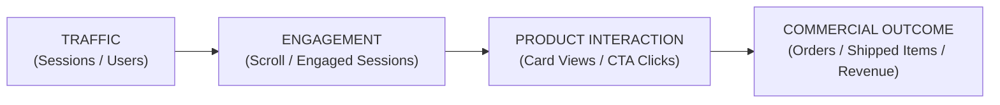

# Product Performance & Learning Intelligence (v1.0)

## 1. Executive Summary & Core Principle

`elevate-product-performance-intelligence` is Elevate's post-publication evidence and performance feedback learning skill. It evaluates real-world telemetry after an article or product recommendation is published to inform future editorial and research decisions.

### Core Principle
$$\text{OBSERVED BEHAVIOR} \neq \text{CAUSAL EXPLANATION}$$

The skill strictly demarcates 4 evidence states:
- `OBSERVED`: Empirical measurement from telemetry (e.g. 150 clicks recorded).
- `INFERRED`: Logical deduction supported by multiple aligned telemetry signals.
- `HYPOTHESIZED`: Proposed rationale requiring controlled testing.
- `UNKNOWN`: Missing, unverified, or ambiguous data.

### Strict Prohibitions
Never claim guaranteed sales, guaranteed conversions, guaranteed revenue, guaranteed search rankings, guaranteed Pinterest traffic, or unverified causal relationships.

---

## 2. Telemetry Data Sources & Metric Families

### Accepted Telemetry Sources
1. **Google Analytics 4 (GA4):** Sessions, engaged sessions, engagement rate, landing page views.
2. **Microsoft Clarity:** Scroll depth, interaction heatmaps, mobile/desktop viewport behavior.
3. **Amazon Associates Reports:** Verified orders, shipped items, conversion rate, commission (where available).
4. **Google Search Console:** Organic impressions, clicks, CTR, average query position.
5. **Affiliate Click Telemetry:** Outbound CTA clicks, card interaction events, Shop The Look clicks.
6. **Internal System Audits:** Product catalog, freshness records, portfolio logs.

> [!CAUTION]
> **Data Integrity Gate:** Use ONLY data actually available. Never fabricate missing metrics or convert clicks into assumed sales.

### The 4 Metric Families



1. **TRAFFIC METRICS:** Sessions, active users, organic traffic, referral traffic.
2. **ENGAGEMENT METRICS:** Engagement rate, engaged sessions, scroll depth, interaction depth.
3. **PRODUCT INTERACTION METRICS:** Product card views, CTA clicks, Shop The Look clicks, outbound affiliate clicks.
4. **COMMERCIAL OUTCOME METRICS:** Ordered items, shipped items, conversion rate, revenue (requires Amazon Associates report).

---

## 3. Telemetry Classification Matrix

### Product-Level Performance Schema

```json
{
  "product_performance_record": {
    "article_id": "living-room-refresh-2026",
    "asin": "B08N5WRWNW",
    "section": "2. Floating Wall Shelves",
    "role": "PRIMARY_SOLUTION",
    "placement": "FEATURED_SOLUTION",
    "observation_window": "2026-08-01_TO_2026-08-31",
    "metrics": {
      "impressions": {"value": 4200, "status": "VERIFIED"},
      "card_views": {"value": 2800, "status": "VERIFIED"},
      "outbound_clicks": {"value": 185, "status": "VERIFIED"},
      "ctr": {"value": "4.4%", "status": "VERIFIED"},
      "orders": {"value": "UNKNOWN", "status": "NOT_AVAILABLE"},
      "revenue": {"value": "UNKNOWN", "status": "NOT_AVAILABLE"}
    },
    "device_breakdown": {
      "desktop_click_rate": "5.2%",
      "mobile_click_rate": "3.8%"
    },
    "performance_state": "HIGH_INTERACTION",
    "confidence": "HIGH",
    "observation_summary": "Observed strong outbound click rate on desktop; mobile click rate trails by 1.4 percentage points."
  }
}
```

### Article-Level Pattern Classifications
- `HIGH_TRAFFIC_LOW_PRODUCT_INTERACTION`: High visitor volume; low CTA interaction (may indicate context disconnect).
- `LOW_TRAFFIC_HIGH_PRODUCT_INTERACTION`: Low traffic; high CTA interaction rate (indicates strong intent alignment).
- `HIGH_ENGAGEMENT_HIGH_PRODUCT_INTERACTION`: High engaged sessions and high product clicks (strong editorial fit).
- `HIGH_TRAFFIC_HIGH_PRODUCT_INTERACTION`: High volume across all metrics.
- `LOW_DATA`: Sample size too small for meaningful observation ($\le 100$ sessions).
- `MIXED_SIGNAL`: Conflicting signals across devices or sections.
- `INSUFFICIENT_EVIDENCE`: Insufficient observation window or missing telemetry.

---

## 4. Controlled Editorial Experimentation Framework

When testing editorial updates (CTA wording, card placement, Shop The Look presentation):

```markdown
HYPOTHESIS: Moving the floating shelf card below the layout principle paragraph will increase mobile reading engagement.
VARIABLE: Card Placement (Control: Mid-paragraph vs. Test: Post-principle).
CONTROL: Current published section layout (50% traffic or baseline period).
TEST: Modified section layout.
MEASURE: Mobile engagement rate & CTA click rate.
OBSERVATION WINDOW: 14 days (min 1,000 mobile sessions).
SUCCESS SIGNAL: Higher engaged sessions with non-declining CTA clicks.
LIMITATIONS: Seasonal search fluctuations during test window.
```

### Experiment Safety Rules
- Change ONLY ONE variable at a time.
- Prohibit dark patterns, fake urgency, hidden disclosures, or manipulative CTAs.

---

## 5. Inter-Skill Feedback Protocols

- **`elevate-product-freshness-intelligence`:** Passes telemetry timestamps (`OBSERVED_AT`, `OBSERVATION_WINDOW`). Stale data must not be treated as current.
- **`elevate-trend-demand-intelligence`:** Keeps `OBSERVED_SITE_BEHAVIOR` separate from `EXTERNAL_TREND_SIGNAL`.
- **`elevate-product-research-intelligence`:** Telemetry clicks generate `OBSERVED_INTEREST_SIGNAL` (never "proven best product").
- **`elevate-product-portfolio-intelligence`:** Flags brand/category interaction concentration.
- **`elevate-product-opportunity-scoring`:** Integrates telemetry as one contextual input alongside trend, problem, and niche fit.

---

## 6. Article & Product Performance Reports

### Article Performance Report Schema

```markdown
### Product Performance Record

ARTICLE: 7 Small Living Room Storage Solutions
INTENT: SMALL_SPACE
OBSERVATION WINDOW: 2026-08-01 to 2026-08-31

TRAFFIC SUMMARY: 12,400 Sessions (82% Organic, 18% Pinterest)
ENGAGEMENT SUMMARY: 68% Engagement Rate; Average Engaged Time 2m 15s
PRODUCT INTERACTION SUMMARY: 540 Outbound Affiliate Clicks (4.35% Overall CTR)
COMMERCIAL SUMMARY: 32 Orders Verified (via Amazon Associates Report)
DEVICE SUMMARY: Desktop CTR 5.2% vs. Mobile CTR 3.8%
CONFIDENCE: HIGH

### Interpretation
OBSERVATION: Mobile CTR trails Desktop CTR across all 4 product card sections.
POSSIBLE EXPLANATIONS: Mobile product card CTAs require vertical scrolling past large product imagery.
UNKNOWN FACTORS: Mobile user purchase intent vs. desktop research behavior.

### Recommended Next Step
TEST: Evaluate mobile product card image aspect ratio adjustment in `elevate-editorial-product-integration`.
```
